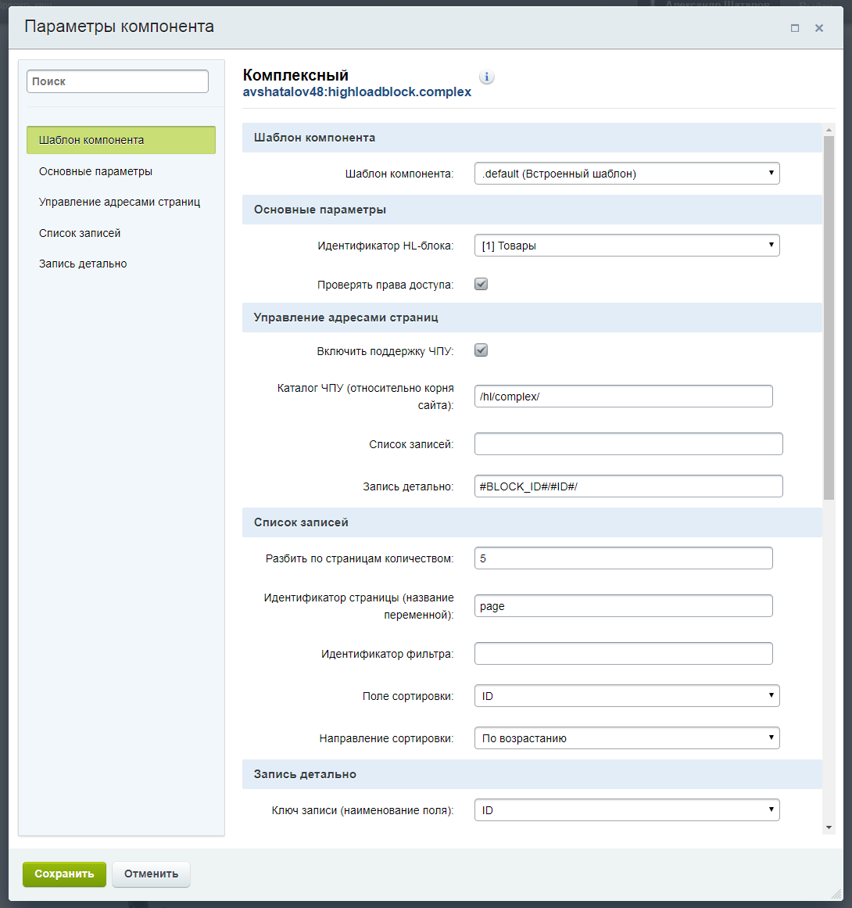

# Комплексный компонент для работы с элементами Highload-блоков Битрикс

Комплексный компонент "highloadblock.complex" объединяет функционал стандартных компонентов "highloadblock.list" и "highloadblock.view", позволяет создать раздел из элементов HL-блока на сайте. Доступен просмотр списка элементов, детальной информации, настройка ЧПУ, удобный выбор параметров и т.д. 

### Установка компонента
1. Скачайте или склонируйте репозиторий.
2. Каталог с компонентом "highloadblock.complex" необходимо разместить на сайте по адресу "/local/components/avshatalov48/".
3. Обновите компоненты в визуальном редакторе (Компоненты > Обновить).
4. Выберете и подключите компонент (Контент > Highload инфоблоки > Комплексный).
5. Заполните необходимые параметры.
6. Сохранить.



### Пример вызова компонента
``````php
<?
$arFilter = [
    '>=ID' => 3,
];
?>

<? $APPLICATION->IncludeComponent(
    "avshatalov48:highloadblock.complex",
    ".default",
    [
        "BLOCK_ID"           => "1",
        "CHECK_PERMISSIONS"  => "Y",
        "FILTER_NAME"        => "arFilter",
        "PAGEN_ID"           => "page",
        "ROWS_PER_PAGE"      => "5",
        "ROW_KEY"            => "ID",
        "SEF_FOLDER"         => "/hl/complex/",
        "SEF_MODE"           => "Y",
        "SORT_FIELD"         => "ID",
        "SORT_ORDER"         => "ASC",
        "COMPONENT_TEMPLATE" => ".default",
        "SEF_URL_TEMPLATES"  => [
            "list" => "",
            "view" => "#BLOCK_ID#/#ID#/",
        ],
    ],
    false
); ?>
``````

### Полезные ссылки

* [Ядро "1С-Битрикс: Управление сайтом" Бизнес. Каталог /modules/](https://github.com/avshatalov48/bitrix-core-business/)
* [Ядро "1С-Битрикс24" Корпоративный портал. Каталог /modules/](https://github.com/avshatalov48/bitrix24-core-corp/)
